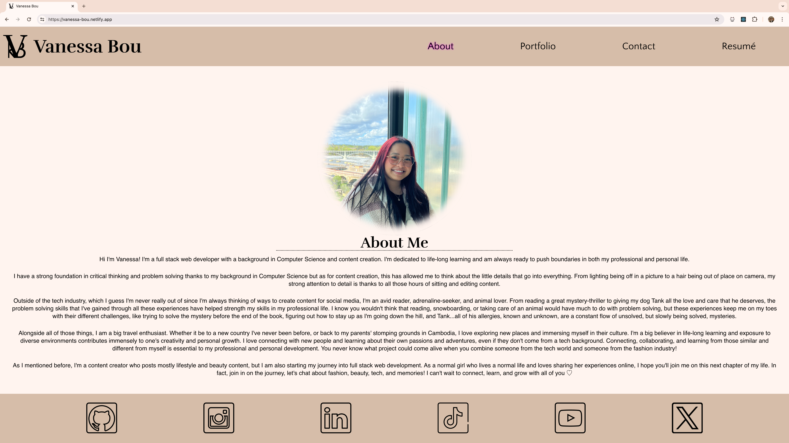
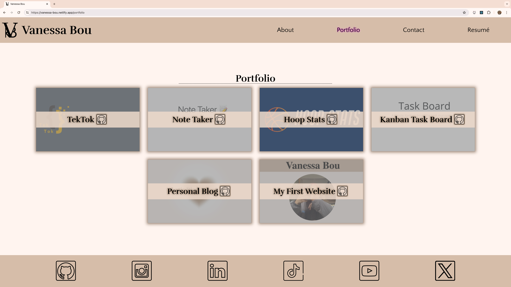
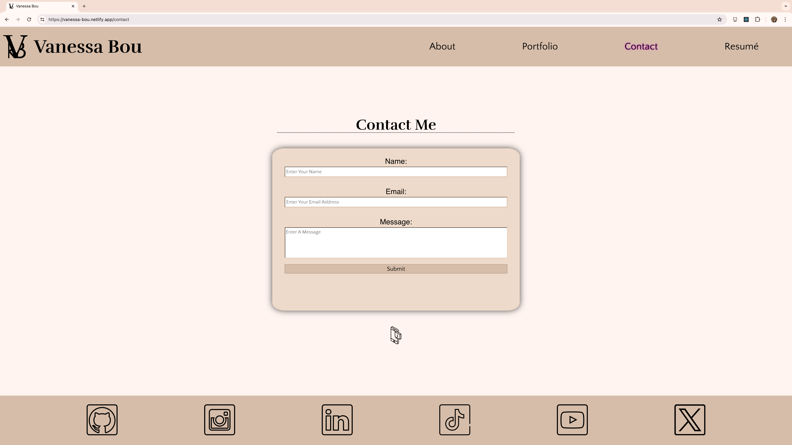
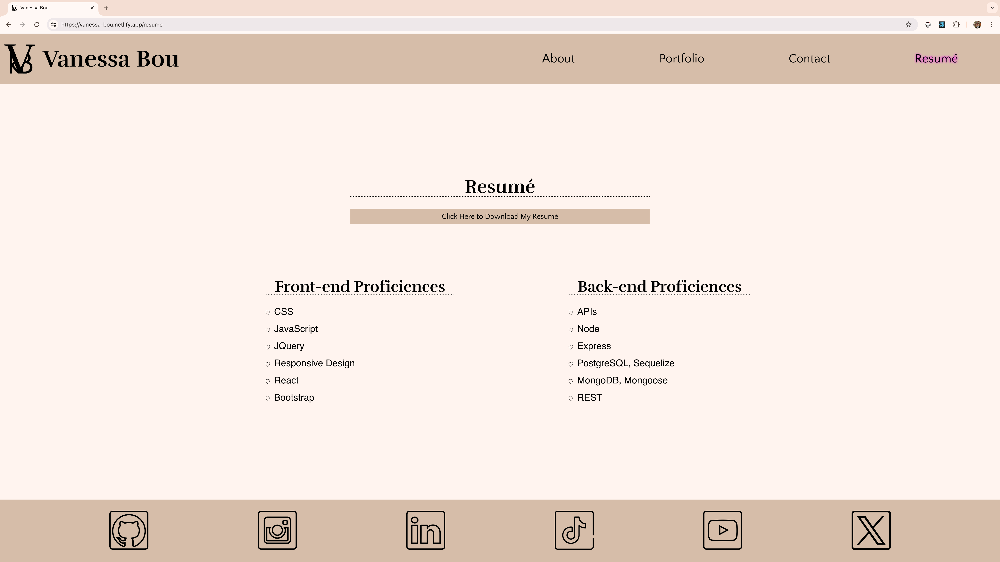

# React-Portfolio

[](https://app.netlify.com/sites/vanessa-bou/deploys)

## Description

This portfolio application was developed and designed to showcase my projects, resume, and skills to potential employers, clients, and others interested in seeing my work. It was created using React, an open sourced JavaScript library for building user interfaces. It operates via a one page application, but gives the user experience of multiple page functionality.

As of right now, this application is all front-end, but I will be looking into adding a backend framework so that the contact form on the Contact page can be functional.

Some of the challenges that I faced while creating this application can be found [here in the Challenges section](#challenges).

## Table of Contents

* [Description](#description)

* [Authors](#authors)

* [Badges and Acknowledgements](#badges-and-acknowledgements)

* [Installation](#installation)

* [Challenges](#challenges)

* [Usage and Screenshots](#usage-and-screenshots)

* [Functionality](#functionality)

* [Suggested Future Development](#suggested-future-development)

* [Deployed Application](#deployed-application)

## Authors

**[Vanessa Bou](https://github.com/rvbouu)**

## Badges and Acknowledgements

**Thank you** to my instructor Gary and TA Katy for assisting me in deploying my website.

[](https://www.netlify.com/)
[](https://react.dev/)
[](https://reactrouter.com/en/main)

[](https://www.javascript.com/)
[](https://nodejs.org/en)

[](https://code.visualstudio.com/)
[](https://github.com/)

[](https://animate.style/)
[](https://react-popup.elazizi.com/)

## Installation

💾

* To make changes to the code base:
  - clone the repo (https://github.com/rvbouu/react-portfolio)
  - run `npm i` within the root directory
  - run `npm run dev`
   
   you will then be taken to a live server running the site where if edits are made to the code base they can be seen in real time.

* Users can also feel free to access the live application directly by visiting the [Netlify link](https://vanessa-bou.netlify.app/).

## Challenges

* #### Getting the animation in the header to work how I imaged
  - At first, I was trying to find a way that I could do one animation that would do everything, but soon realized that it wasn't possible (at my current skill level). Then, I broke up the animation I wanted into pieces. By implementing the [Animate.css](https://animate.style/) library as well as some keyframing in my custom stylesheet, I was able to acheive the look that I wanted!

* #### Getting images for each project card to display at all
  - This one and the next were tough ones. At first, I thought simply adding the project images to a folder in my src folder then adding the pathing to my .json file would work but it ended up throwing errors. Then I tried uploading the images to Google Drive and using the shared link from each as their path would work, but I ran into third-party blocking errors. Another route that I went down was trying to upload the images to my GitHub profile to get a link from there, but in my research I found that GitHub has taken away that ability (or made it so hidden that not many can use it now). When I was about to give up and hard code all the images in since they wouldn't appear when I tried dynamically rendering them, I moved the project_imgs folder to the public folder, changed the pathing to be similar to path you would see in Handlebars.js, then behold! My images finally appeared and were rendering dynamically.

* #### Getting the active page to stay highlighted in the navigation bar
  - With the requirements that we were given for this assignment, I researched ways to style the Link hooks when a component is active. All documentation that I read told me that Link hooks no longer had styling ability for active components and to use NavLink, which I was hesitant at first since our README had state to use Link. I tried implementing NavLink instead of Link, using the activeStyle, activestyle, and active attributes but nothing had worked and would throw errors. As I continued reading the documentations for NavLink, I found that activeStyle (the main attribute that seemed to be used for this particular type of styling) is no longer being used by React Router and that there were a lot of changes from React Router v5 and v6, which I wasn't aware of at first. But in the end, after reading many documentations, I found that to apply this styling, you set a style attribute, and write a function for isActive that will return the styling you want to be applied to the active component.
  ```
  <NavLink style={({ isActive }) => {
        return isActive ? { <css property>: 'value' } : {};
      }} className='navEl' >Enter Text Here</NavLink>
  ```

## Usage and Screenshots

This application is very user intuitive, just visit the [site](https://vanessa-bou.netlify.app/), navigate through different pages using the links in the navigation bar, and view desired content.

#### About/Homepage


#### Portfolio page


#### Contact page


#### Resumé page


## Functionality


## Suggested Future Development

* Dark Mode Toggle

* Continued display and UI development

* Hamburger menu implemented on the navbar

* Potential to add additional pages for showcasing photos, travel blog, social media content, and book list

* Add backend and middleware so users can contact me (Express/MySQL, or GraphQL/MongoDB)

* Add addition of useEffect

* Including unit testing

## Deployed Application

[Link to deployed application on Netlify](https://vanessa-bou.netlify.app/)